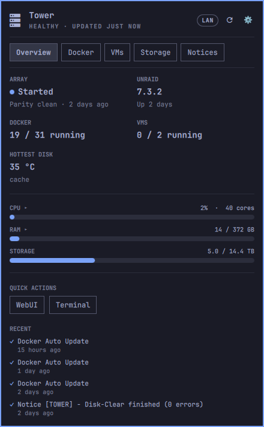
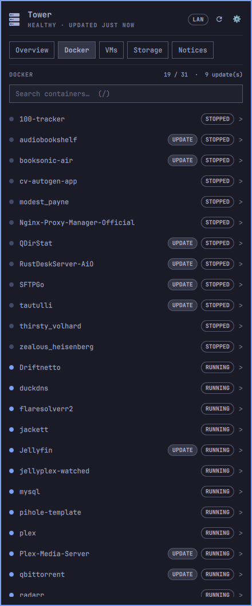
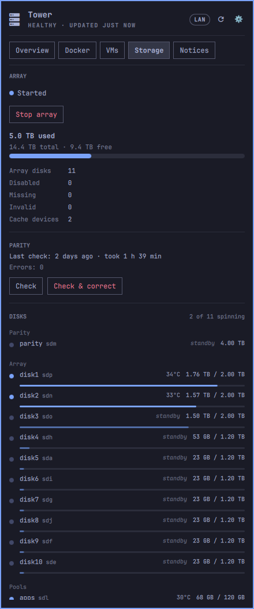
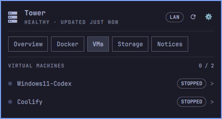
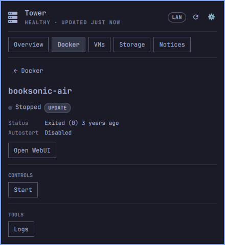
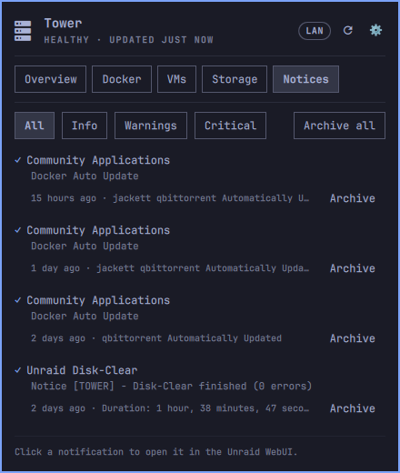
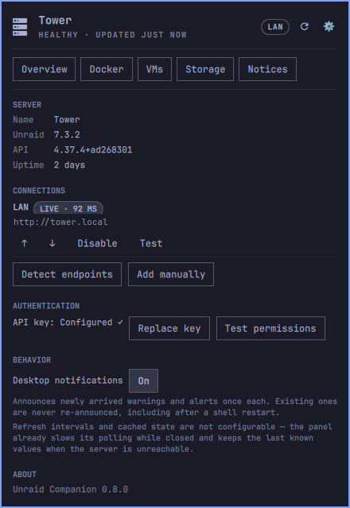

# Omarchy Unraid Companion

Monitor and control an Unraid server from the Omarchy bar — Docker, VMs,
the array, parity and notifications, over Unraid's own GraphQL API.

https://github.com/user-attachments/assets/6779a169-43d1-4036-b805-82160848f562

## Install

```bash
omarchy plugin add https://github.com/b0d3ll/omarchy-unraid.git --enable
omarchy restart shell
```

Click the bar widget and a three-step wizard takes it from there: server
address, then an API key from **Unraid → Settings → Management Access →
API Keys**.

A read-only key gets every view. Controlling Docker, VMs, the array or a
parity check needs the matching update permission — and the controls say
exactly which one is missing rather than failing silently.

The key goes into your system keyring via `secret-tool`. Never a config
file, and never a command line where `ps` could read it.

```bash
omarchy plugin update io.github.b0d3ll.omarchy-unraid   # update
omarchy plugin remove io.github.b0d3ll.omarchy-unraid   # remove
```

## What you get

- **Overview** — array state and last parity check, Unraid version and
  uptime, Docker and VM counts, hottest disk, CPU / RAM / storage, and
  recent notices. Click CPU or RAM to break them down per core and per
  kind.
- **Docker** — every container with state and update badges, searchable;
  per-container detail with start / stop / restart, Open WebUI and a log
  viewer.
- **VMs** — every domain with state; start, stop, reboot, pause, resume,
  reset and force stop. That is every VM mutation the API exposes.
- **Storage** — capacity, per-disk list with spin state and temperature,
  array start/stop and parity check start / pause / resume / cancel.
- **Notices** — every unread notification, filterable, archivable one at a
  time or all at once.
- **Connections** — several endpoints in priority order with automatic
  failover. LAN at home, Tailscale away, no interaction.

Polling slows down while the panel is closed and speeds up while it is
open. Each resource is queried independently, so one unavailable subsystem
never blanks the rest or reports the server as offline.

## Keyboard

Omarchy is keyboard-driven, so the panel is too.

| Key | Action |
| --- | --- |
| `1`–`5` | jump to a tab |
| `←` / `→`, `h` / `l` | cycle tabs |
| `↑` / `↓`, `k` / `j` | move the cursor inside the tab |
| `Enter` / `Space` | activate what the cursor is on |
| `/` | jump to the Docker search box |
| `r` | refresh everything |
| `Esc` | leave a text field, else back out, else close |

Horizontal is *which tab*, vertical is *which thing in it*. A container
can be found, opened and restarted without touching the mouse.

## Screenshots

| Overview | Docker | Storage |
| --- | --- | --- |
|  |  |  |

| VMs | Container detail | Notices |
| --- | --- | --- |
|  |  |  |

| Settings | | |
| --- | --- | --- |
|  | | |

The walkthrough above, and every shot here, was captured by driving the
panel from the keyboard — which is also what it demonstrates. A copy of
the clip lives in [`docs/demo.mp4`](docs/demo.mp4).

## Requirements

- `secret-tool` (part of `libsecret`) and a running Secret Service provider
  (e.g. `gnome-keyring-daemon`) for API key storage.
- `curl` and `bash` for API requests.


---

## How it works

The sections below are the reasoning behind the parts that are not
obvious — mostly places where Unraid's API needs handling rather than
trusting.

<details>
<summary><b>Disk-sleep safety — why the disk list does not wake your drives</b></summary>

What actually wakes a sleeping HDD is the API's `DisksService`, behind the
top-level `disks`/`disk` query root: it shells out to `smartctl` and to
systeminformation's `diskLayout()`, so `Disk.temperature` and
`Disk.smartStatus` cost a spin-up. No query in the plugin may go near
those.

`array { parities/disks/caches }` is *not* in that category, which is why
the Storage view can list every drive without touching one. Those fields
are read out of the emhttp state the API already holds in memory, parsed
from `/var/local/emhttp/disks.ini` — see `get-array-data.ts` and
`state-parsers/slots.ts` in [unraid/api](https://github.com/unraid/api).
Every `ArrayDisk` field comes from that file, `temp` and `isSpinning`
included, so a parked drive answers `temp: null` instead of being woken to
report a number. It is the same data the Unraid Main page renders.

The plugin's original rule banned the word `disks` outright, which was
wider than the real hazard and cost the Storage view its whole disk list.
`tests/no-disk-queries.sh` now enforces the narrow version — it evaluates
`Api.js` and checks the operations that are actually sent, so a query
assembled from fragments is judged whole. Run it before committing changes
to `Api.js`:

```bash
./tests/no-disk-queries.sh
```

</details>

<details>
<summary><b>What drives the health dot, and how to clear it</b></summary>

The bar's dot, its label, and Overview's banner are three renderings of one
ladder in `Panel.qml`'s `healthState`, checked top down:

| Condition | State |
| --- | --- |
| Not configured / API key rejected / unreachable / stale | own states |
| A missing array disk | CRITICAL |
| An unread **alert** | CRITICAL |
| The last parity check found errors | WARNING |
| An unread **warning** | WARNING |
| A disabled or invalid array disk | NOTICE |
| Parity check running, or array not started | NOTICE |
| otherwise | HEALTHY |

So it is state, not a message: nothing is dismissible on its own, and each
rung clears when the condition underneath it stops being true. The unread
rungs are the ones under your control — archive the notification (in
Notices, or in the Unraid WebUI) and the dot drops to the next true rung.
An "attention needed" that will not go away usually means an old unread
warning is still sitting in the list — "Archive all" on the Warnings filter
clears exactly that.

Its count comes from the server's own unread counters rather than from the
rows on screen: the list is fetched with `limit: 50`, so on a larger
backlog the visible rows would understate what the button is about to
archive.

The tab carries no count. The dot and the banner already say that
something needs attention, and all three read the same unread
warning+alert figure — a third copy of one number said nothing new.

Compact rows show a notification's `subject` ("Docker Auto Update",
"Disk-Clear finished (0 errors)") rather than its `title` ("Community
Applications"), which is the component that raised it and repeats across
everything it sends.

</details>

<details>
<summary><b>Parity reporting — four API fields that are never populated</b></summary>

`array.parityCheckStatus` declares `running`, `paused`, `correcting` and
`errors`, but the API never assigns any of them: `getParityCheckStatus`
(`api/src/core/modules/array/parity-check-status.ts`) returns only
`status`, `speed`, `date`, `duration` and `progress`, so the other four are
always null. Reading them as booleans meant `running` was permanently
false and the parity progress bar was dead code that could not appear
during a real check; `errors` was worse, because `num(errors, 0)` turned a
null into a confident `0` and printed "Errors: 0" whether or not the last
check had found any.

Running and paused are now derived from `status`, which does carry
`RUNNING` and `PAUSED`. Real error counts come from `parityHistory`, which
parses the parity log — that is also where "last check" comes from. Note
that `parityCheckStatus.date` is when a check *started* while
`parityHistory[].date` is when it *finished*; they differ by `duration`.

A running check reports no error count anywhere, so the progress view
shows percentage and speed and says nothing about errors.

</details>

<details>
<summary><b>Disk counters — where the server contradicts itself</b></summary>

`vars.mdNumDisabled` and `vars.mdNumInvalid` can report a count while every
disk in the array reports `DISK_OK`, with the array started and a clean
parity check behind it. The API passes those numbers through from `var.ini`
untouched (`state-parsers/var.ts` is a plain `toNumber` per field), so the
disagreement is emhttp's own bookkeeping rather than anything in transit —
but it was enough to keep the bar's health dot permanently on "attention
needed".

So Disabled / Missing / Invalid / Cache devices are now counted from the
per-disk `status` in the array's own disk list, which is what the Unraid
Main page draws. `vars` stays the fallback for a server that answers the
array summary but not the disk lists, and `arrayInfo.countsDerived` says
which of the two a given reading came from. Counting from the list also
fixes the cache count: `vars.cacheNumDevices` answers `NaN` on a server
with pools — a partial GraphQL error and a null field — which used to
render as "—" next to two plainly present pool devices.

This is why the disk lists ride along with the array summary in one query
instead of being fetched only while the Storage tab is open: the health dot
is derived from them and is on screen whether or not anyone has that tab
open.

</details>

<details>
<summary><b>Notifications</b></summary>

The panel lists every unread notification, not just warnings and alerts.
It used to query `notifications.warningsAndAlerts`, which meant a notice
could resolve an alarm without the panel ever saying so: "Disk-Clear
started" sat on screen as a warning while "Disk-Clear finished (0 errors)"
was filtered out. `notifications.list(filter: { type: UNREAD, … })` with no
`importance` returns every level.

What stays keyed to warnings and alerts only: the health dot, the Overview
banner, and desktop notifications. Listing an INFO notice should not make
the bar look alarmed or ping the desktop three times a week.

</details>

<details>
<summary><b>Connection handling and failover</b></summary>

Endpoints are tried in priority order. A working one is kept until it
fails twice in a row, and a better one is only adopted back after it
succeeds twice — so a flapping link can't make the plugin oscillate. When
nothing answers, the panel keeps showing the last known state with its
age, disables the controls, and retries on an escalating 15s→5min backoff;
opening the panel or hitting Refresh retries immediately.

The selection rules live in `Selection.js` as pure functions with no QML
in them, so they're unit-tested rather than eyeballed:

```bash
node tests/selection.test.js
```

</details>

<details>
<summary><b>HTTPS and self-signed certificates</b></summary>

An address is used exactly as typed — `https://tower.local` stays HTTPS.
A bare host still defaults to `http://`, which is how Unraid ships.

Unraid's HTTPS listener normally presents a self-signed certificate, which
curl rejects, and the panel used to report that as a flat "could not reach
the server" — the opposite of what happened. A certificate failure now says
so and points at the switch, and **Settings > Server > Allow self-signed
certificate** (also offered during onboarding, for an `https://` address)
turns on curl's `insecure` for that endpoint. It applies only to HTTPS
endpoints: setting it on a plain HTTP request is meaningless, and leaving
it permanently on would weaken a properly-certificated server too.

The failure *reason* stays `unreachable` internally even for a certificate
error. That string is the connection layer's vocabulary — `ConnectionManager`
only counts `unreachable` toward failover — so a separate `tls` reason would
have quietly stopped a certificate-broken endpoint from ever failing over to
a working one.

Replies are capped with `curl --max-filesize`. A reply is a GraphQL
document, never a payload; the largest legitimate one here is the parity log
at ~8.5 KB.

</details>

<details>
<summary><b>CPU cores and memory</b></summary>

Clicking the CPU row expands a strip with one column per core — 40 of them
on the machine this was built against — each a miniature track and fill,
red past 90%. It is collapsed by default, because that much panel is only
worth spending once the total has told you to look.

The per-core figures ride along with the CPU total rather than getting
their own query: it is the same resolver, and forty floats is nothing next
to the round trip it would cost.

The RAM row expands the same way. There is no per-DIMM figure in the API,
so what it shows is what the one number is made of:

| Row | Meaning |
| --- | --- |
| In use | `total - available`, the figure the bar draws |
| Cache | `buffcache` — counted as used by Linux, available to anything that needs it |
| Available | what something could actually get |
| Swap | used / total, or "none configured" |

`used` is deliberately not among them. The server reports 136 GB used on a
box whose applications hold 14, because Linux counts 128 GB of page cache
as used — printing that as "RAM used" would be true and useless. In use
and Available sum to the total, so checking the arithmetic is not punished
with a contradiction.

Swap was not reported at all before this.

</details>

<details>
<summary><b>Disk temperature</b></summary>

Overview shows the hottest disk that is currently reporting one, as a value
alongside the Docker and VM counts. A temperature is not a percentage of
anything, so it does not get a bar. A parked disk reports no
temperature — the server never woke it to measure — so it is skipped
rather than counted as cold, and an array that is entirely asleep reads
"all disks in standby" with no bar, because an empty bar would say "cold"
instead of "not measured".

Pool devices are included, since they are disks too. Each is judged
against *its own* `warning`/`critical` thresholds where Unraid has them,
falling back to Unraid's defaults of 45 °C and 55 °C — which is also what
Unraid itself applies. That keeps a pool NVMe, which idles warmer than a
platter, from being judged by a platter's standard.

</details>

<details>
<summary><b>State vocabulary</b></summary>

Three different enums reach the panel raw, and all three now get labels
from the same source Unraid's own webGUI words them with.

`VmState` is libvirt's domain-state enum passed through unchanged, so a VM
that is off reports `SHUTOFF`. Unraid's VM manager calls that "Stopped",
which is the word the panel uses — "Offline" would suggest the VM can't be
reached rather than that it simply isn't running. All eight states have
labels.

`ContainerState` is Docker's vocabulary — `RUNNING` / `PAUSED` / `EXITED`.
Unraid's Docker page words these as started/stopped/paused, so a stopped
container reads "Stopped" rather than "Exited". `RESTARTING` and `DEAD`
aren't in the enum but are real Docker states that the sort order already
accounts for, so they get labels too.

`array.state` is likewise the API's `ArrayState` enum, straight from
emhttp's `mdState` — "Started" and "Stopped" are the Unraid webGUI's own
wording, which is why the panel keeps them. Its other nine values are error
states (`TOO_MANY_MISSING_DISKS`, `PARITY_NOT_BIGGEST`, …) that used to
render raw. All three fall back to a sentence-cased version of an
unknown future value rather than shouting it.

</details>


## Development

```bash
# Validate the manifest
omarchy plugin validate .

# qmllint needs a directory that has a "qs" entry pointing at the Omarchy
# shell root — Quickshell's qs.Commons/qs.Ui module resolution is its own
# thing, not something plain `-I "$OMARCHY_PATH/shell"` resolves on its
# own. One-time setup, then lint:
mkdir -p /tmp/omarchy-lint-root
ln -sfn "$OMARCHY_PATH/shell" /tmp/omarchy-lint-root/qs
/usr/lib/qt6/bin/qmllint -I /tmp/omarchy-lint-root -I /usr/lib/qt6/qml \
  Panel.qml UnraidService.qml ConfigStore.qml SecretStore.qml \
  views/*.qml components/*.qml onboarding/*.qml

# `Style.font.*`/`Color.popups.*`-style warnings ([missing-property] on a
# singleton's nested QtObject) are a known qmllint limitation, not a real
# bug — Omarchy's own first-party plugins (e.g. weather/Panel.qml) produce
# the same warnings under this exact command. Only worry about anything
# that isn't in that category.

# omarchy plugin add only takes a git URL, so local development is a
# symlink: drop this repo into ~/.config/omarchy/plugins/<id>, then enable
# and reload. `omarchy plugin validate` will complain about the top-level
# symlink (it's meant to catch symlinks *inside* a plugin folder) — that
# complaint doesn't affect the running shell.
ln -s "$(pwd)" ~/.config/omarchy/plugins/io.github.b0d3ll.omarchy-unraid
omarchy plugin enable io.github.b0d3ll.omarchy-unraid
omarchy restart shell
```


## Roadmap

Not there yet: multiple servers, container updates and installs, share
management, SMART monitoring, and Unraid Connect as a transport.

Settings is the one tab without keyboard cursor support.
